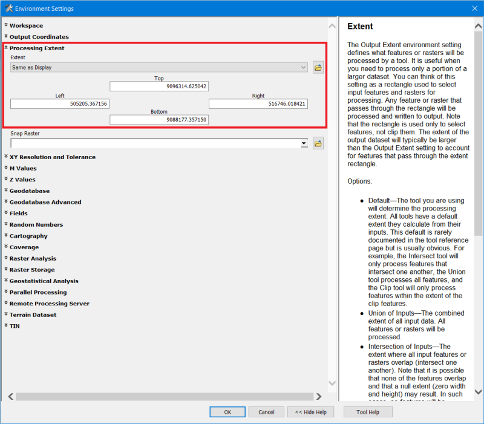

## Tsunami Inundation Toolbox ArcGIS Desktop 10.x
Toolbox untuk pemodelan genangan tsunami (tsunami inundation) di ArcGIS Desktop 10.x

1. **Add Toolbox...** pada ArcToolbox

	

2. Arahkan pada **TsunamiInundation.tbx** dari folder toolbox
3. Akan muncul tool Tsunami Inundation pada ArcToolbox
	
    
    
4. Jalankan tool Tsunami Inundation
5. Masukkan data dan tentukanlah output data ke dalam File Geodatabase
	
    
    
6. Hasil modeling untuk tinggi gelombang maksimal 20 meter seperti ini
	
    
	
	
##
Catatan:
1. Pastikan semua data input menggunakan sistem koordinat terproyeksi (_Projected Coordinate System_), misalnya UTM
2. Jika proses bermasalah dengan isu _extent_ atau hasil akhirnya terpotong, ulangi prosesnya dengan mengatur _**Processing Extent**_ pilih _**Same as display**_ dari _**Environments...**_

	
	

##
Data sampel: [unduh di sini](https://www.dropbox.com/s/agoia1oj2l4jbn1/Data.zip?dl=0)

##
Tutorial video: [Youtube](https://youtu.be/xhSXq2z1jtc)

##
Literatur:
1. Buku _**Coastal Monitoring and Hazard Modeling**_. Penulis: Aris Marfai, Fredi Satya Candra Rosaji, Warsini Handayani
2. [Buku Risiko Bencana Indonesia](http://inarisk.bnpb.go.id/pdf/Buku%20RBI_Final_low.pdf)