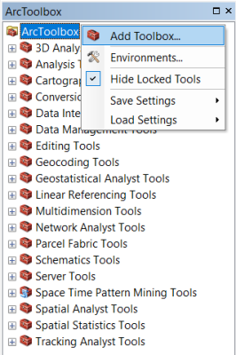
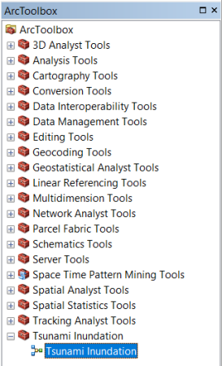
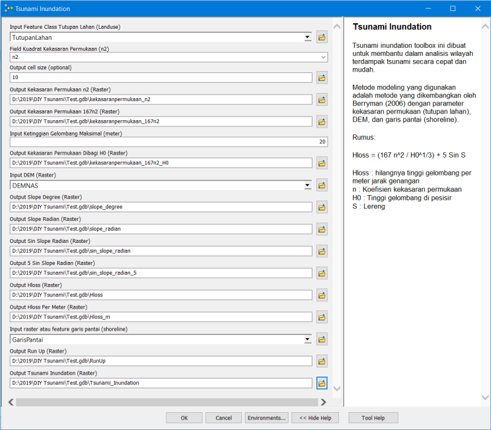
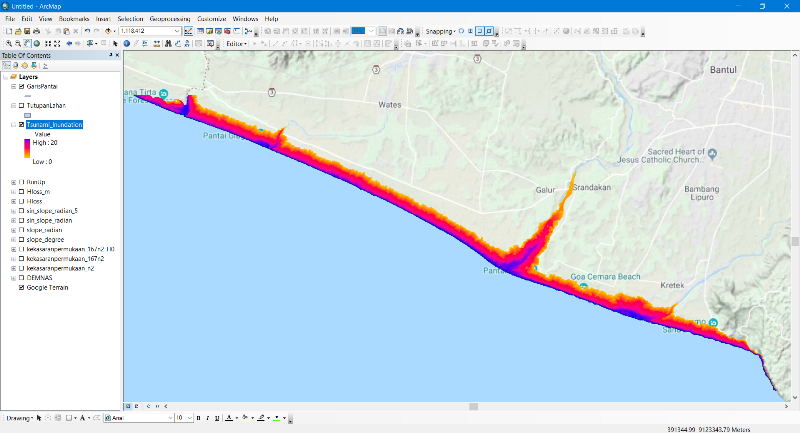

## Tsunami Inundation Toolbox ArcGIS Desktop 10.x
Toolbox untuk pemodelan genangan tsunami (tsunami inundation) di ArcGIS Desktop 10.x

1. **Add Toolbox...** pada ArcToolbox

	

2. Arahkan pada **TsunamiInundation.tbx** dari folder toolbox
3. Akan muncul tool Tsunami Inundation pada ArcToolbox
	
    
    
4. Jalankan tool Tsunami Inundation
5. Masukkan data dan tentukanlah output data ke dalam File Geodatabase
	
    
    
6. Hasil seperti ini
	
    

##
Data sampel: [unduh di sini](https://www.dropbox.com/s/agoia1oj2l4jbn1/Data.zip?dl=0)

##
Literatur:
1. Buku _**Coastal Monitoring and Hazard Modeling**_. Penulis: Aris Marfai, Fredi Satya Candra Rosaji, Warsini Handayani
2. [Buku Risiko Bencana Indonesia](http://inarisk.bnpb.go.id/pdf/Buku%20RBI_Final_low.pdf)